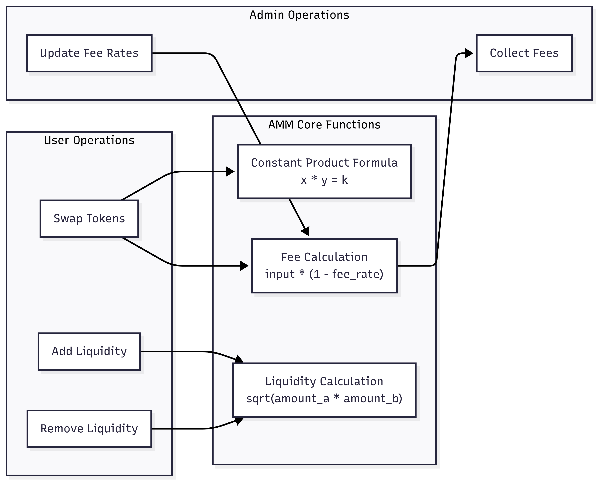

# DeFi Scaffold - Automated Market Maker (AMM) on Sui Move

This repository contains a comprehensive implementation of an Automated Market Maker (AMM) DEX built on Sui Move. The project demonstrates core DeFi primitives including liquidity pools, token swaps, and fee collection mechanisms.

## Architecture Overview

The DeFi Scaffold implements a Uniswap V2-like AMM with the following core components:


### Core Components

1. **TradingPair**: The central object representing a liquidity pool for a pair of tokens
2. **PairRegistry**: Maintains a registry of all trading pairs
3. **LiquidityToken**: Represents ownership shares in a trading pair
4. **AdminCap**: Capability object for administrative functions

## Core Modules

### dex_core.move

The main module implementing the DEX functionality:

```
module defi_scaffold::dex_core;
```

This module contains the core trading pair implementation, pair registry, and all trading functions.

### dex_helper.move

Contains mathematical helper functions for the DEX:

```
module defi_scaffold::dex_helper;
```

This module implements the constant product formula calculations, fee calculations, and other mathematical operations.

## Key Data Structures

### TradingPair

```move
public struct TradingPair<phantom TokenA, phantom TokenB> has key {
    id: UID,
    reserve_a: Balance<TokenA>,
    reserve_b: Balance<TokenB>,
    liquidity_supply: Supply<LiquidityToken<TokenA, TokenB>>,
    fee_rate_bps: u64,
    protocol_fee_bps: u64,
    collected_fees_a: Balance<TokenA>,
    collected_fees_b: Balance<TokenB>,
}
```

- `reserve_a` and `reserve_b`: Token reserves for the trading pair
- `liquidity_supply`: Supply of liquidity tokens
- `fee_rate_bps`: Trading fee rate in basis points (1/100 of 1%)
- `protocol_fee_bps`: Percentage of trading fees allocated to protocol

### PairRegistry

```move
public struct PairRegistry has key {
    id: UID,
    pairs: Table<PairKey, ID>,
}
```

- `pairs`: Table mapping token pair keys to trading pair IDs

### LiquidityToken

```move
public struct LiquidityToken<phantom TokenA, phantom TokenB> has drop {}
```

- Represents ownership share in a trading pair
- Phantom type parameters ensure type safety

## Core Functionality Flow


## Core Operations

### Pair Creation

```move
public fun create_pair<TokenA, TokenB>(
    registry: &mut PairRegistry,
    initial_a: Coin<TokenA>,
    initial_b: Coin<TokenB>,
    fee_rate_bps: u64,
    ctx: &mut TxContext,
): Coin<LiquidityToken<TokenA, TokenB>>
```

1. Validates token order (A != B)
2. Ensures pair doesn't already exist
3. Validates fee rate is within limits
4. Creates trading pair with initial liquidity
5. Registers pair in registry
6. Returns initial liquidity tokens

### Adding Liquidity

```move
public fun add_liquidity<TokenA, TokenB>(
    pair: &mut TradingPair<TokenA, TokenB>,
    token_a: Coin<TokenA>,
    token_b: Coin<TokenB>,
    min_liquidity: u64,
    ctx: &mut TxContext,
): (Coin<TokenA>, Coin<TokenB>, Coin<LiquidityToken<TokenA, TokenB>>)
```

1. Calculates optimal deposit amounts based on current ratio
2. Adds tokens to reserves
3. Calculates and mints liquidity tokens
4. Returns unused tokens and new liquidity tokens

### Removing Liquidity

```move
public fun remove_liquidity<TokenA, TokenB>(
    pair: &mut TradingPair<TokenA, TokenB>,
    liquidity_tokens: Coin<LiquidityToken<TokenA, TokenB>>,
    min_amount_a: u64,
    min_amount_b: u64,
    ctx: &mut TxContext,
): (Coin<TokenA>, Coin<TokenB>)
```

1. Burns liquidity tokens
2. Calculates withdrawal amounts proportionally
3. Withdraws tokens from reserves
4. Returns tokens to user

### Token Swapping

```move
public fun swap_a_to_b<TokenA, TokenB>(
    pair: &mut TradingPair<TokenA, TokenB>,
    token_a: Coin<TokenA>,
    min_amount_out: u64,
    ctx: &mut TxContext,
): Coin<TokenB>
```

1. Calculates output amount using constant product formula
2. Applies trading fee
3. Splits fee between protocol and liquidity providers
4. Updates reserves
5. Returns output tokens

### Fee Collection

```move
public fun collect_fees<TokenA, TokenB>(
    pair: &mut TradingPair<TokenA, TokenB>,
    _: &AdminCap,
    ctx: &mut TxContext,
): (Coin<TokenA>, Coin<TokenB>)
```

1. Extracts accumulated protocol fees
2. Returns fee tokens to admin

## Mathematical Models




### Constant Product Formula

The AMM uses the constant product formula: `x * y = k`

For swaps, this means:
```
(reserve_a + amount_in * (1 - fee)) * reserve_b = k
```

Output amount is calculated as:
```
amount_out = reserve_b - (k / (reserve_a + amount_in * (1 - fee)))
```

### Liquidity Calculations

Initial liquidity is calculated as:
```
initial_liquidity = sqrt(amount_a * amount_b)
```

For subsequent deposits:
```
liquidity_minted = min(
    (amount_a * total_liquidity) / reserve_a,
    (amount_b * total_liquidity) / reserve_b
)
```

## Error Handling

The contract defines several error codes to handle invalid operations:

- `EInsufficientInput`: Input amount is too small
- `ESlippageExceeded`: Output amount is below minimum threshold
- `EInvalidFee`: Fee rate is outside allowed range
- `EPairExists`: Pair already exists in registry
- `EInsufficientLiquidity`: Not enough liquidity in pool
- `EInvalidTokenOrder`: Token types must be different
- `EZeroAmount`: Amount cannot be zero

## Events

The contract emits events for key operations:

- `PairCreated`: When a new trading pair is created
- `LiquidityAdded`: When liquidity is added to a pair
- `LiquidityRemoved`: When liquidity is removed from a pair
- `SwapExecuted`: When a token swap is executed

## Security Considerations

1. **Slippage Protection**: Users can specify minimum output amounts to protect against front-running
2. **Fee Mechanism**: Fees are split between protocol and liquidity providers
3. **Type Safety**: Phantom type parameters ensure type safety for trading pairs
4. **Capability-based Admin**: Administrative functions require the AdminCap

## Testing

The contract includes comprehensive tests covering:

1. Core functionality tests
   - Pair creation
   - Liquidity addition (proportional and unbalanced)
   - Liquidity removal
   - Token swaps (A→B and B→A)
   - Fee collection

2. Error condition tests
   - Duplicate pair creation
   - Invalid token order
   - Slippage protection
   - Invalid fee rate
   - Insufficient liquidity

3. Integration tests
   - Complete trading cycle
   - Multiple pairs interaction

4. Mathematical verification tests
   - Constant product invariant
   - Price calculation accuracy

## Usage Examples

### Creating a Trading Pair

```move
let registry = test_scenario::take_shared<PairRegistry>(scenario);
let treasury_a = test_scenario::take_from_sender<TreasuryCap<TokenA>>(scenario);
let treasury_b = test_scenario::take_from_sender<TreasuryCap<TokenB>>(scenario);

let coin_a = coin::mint(&mut treasury_a, 1000, test_scenario::ctx(scenario));
let coin_b = coin::mint(&mut treasury_b, 2000, test_scenario::ctx(scenario));

let lp_tokens = dex_core::create_pair(
    &mut registry,
    coin_a,
    coin_b,
    300, // 3% fee
    test_scenario::ctx(scenario)
);
```

### Adding Liquidity

```move
let pair = test_scenario::take_shared<TradingPair<TokenA, TokenB>>(scenario);
let coin_a = test_scenario::take_from_sender<Coin<TokenA>>(scenario);
let coin_b = test_scenario::take_from_sender<Coin<TokenB>>(scenario);

let (remaining_a, remaining_b, lp_tokens) = dex_core::add_liquidity(
    &mut pair,
    coin_a,
    coin_b,
    1, // Min liquidity
    test_scenario::ctx(scenario)
);
```

### Executing a Swap

```move
let pair = test_scenario::take_shared<TradingPair<TokenA, TokenB>>(scenario);
let coin_a = test_scenario::take_from_sender<Coin<TokenA>>(scenario);

let output_b = dex_core::swap_a_to_b(
    &mut pair,
    coin_a,
    95, // Min amount out (slippage protection)
    test_scenario::ctx(scenario)
);
```

## Conclusion

This DeFi scaffold provides a robust foundation for building decentralized exchange functionality on Sui Move. The implementation follows best practices for AMM design, including constant product formula, fee mechanisms, and comprehensive testing. 